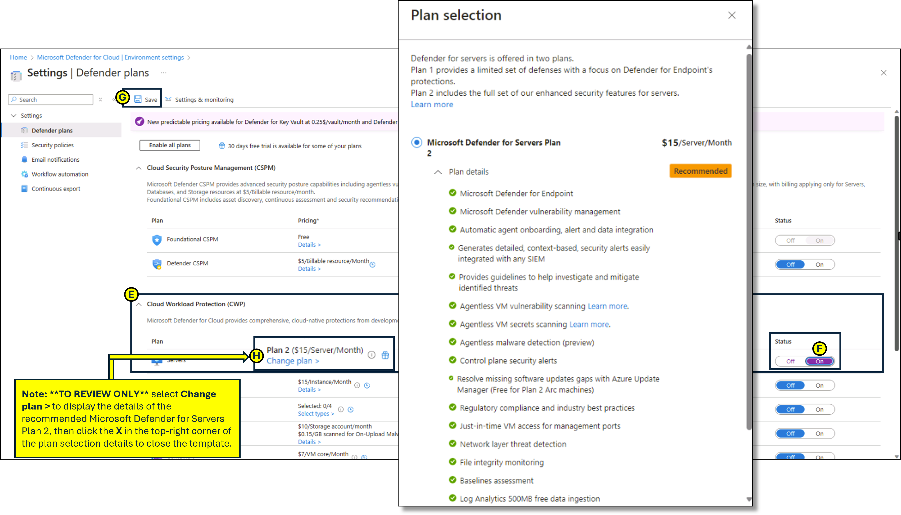

---
lab:
  title: '09: Configuración de características de seguridad mejorada de Microsoft Defender for Cloud para servidores'
  module: Module 03 - Configure and manage threat protection by using Microsoft Defender for Cloud
---

# Laboratorio 09: Configuración de características de seguridad mejorada de Microsoft Defender for Cloud para servidores

# Manual de laboratorio para alumnos

## Escenario del laboratorio

Como ingeniero de seguridad de Azure para una empresa global de comercio electrónico, eres responsable de proteger la infraestructura en la nube de la empresa. La organización se basa en gran medida en máquinas virtuales (VM) de Azure y servidores locales para ejecutar aplicaciones críticas, administrar datos del cliente y procesar transacciones. El director de seguridad de la información (CISO) ha identificado la necesidad de medidas de seguridad mejorada para proteger estos recursos frente a amenazas cibernéticas, vulnerabilidades y configuraciones incorrectas. Se te ha encargado habilitar Microsoft Defender para servidores en Microsoft Defender for Cloud para proporcionar protección contra amenazas avanzada y supervisión de seguridad para máquinas virtuales de Azure y servidores híbridos.

## Objetivos del laboratorio

- Configuración de características de seguridad mejorada de Microsoft Defender for Cloud para servidores
  
- Revisión de las características de seguridad mejoradas para el Plan 2 de Microsoft Defender para servidores

## Instrucciones del ejercicio

### Configuración de características de seguridad mejorada de Microsoft Defender for Cloud para servidores

1. En Azure Portal, en el cuadro de texto Buscar recursos, servicios y documentos de la parte superior de la página, escribe **Microsoft Defender for Cloud** y pulsa la tecla **Entrar** 

2. En **Microsoft Defender for Cloud**, **hoja de Administración**, ve a **Configuración del entorno**. Expande las carpetas de configuración del entorno hasta que se muestre la sección **suscripción** y, después, haz clic en la **suscripción** para ver los detalles.

   
   
3. En la hoja **Configuración**, en **Planes de Defender**, expande **Protección de cargas de trabajo en la nube (CWP)**.

4. En la lista **Plan de protección de cargas de trabajo en la nube (CWP)**, selecciona **Servidores**. En la parte derecha de la página, cambia el **Estado** de **Desactivado** a **Activado** y, después, haz clic en **Guardar**.

5. Para revisar los detalles del **Plan 2 de Microsoft Defender para servidores**, selecciona **Cambiar plan >**.

   Nota: al habilitar el plan de servidores protección de cargas de trabajo en la nube (CWP) de Desactivado a Activado, se habilita el Plan 2 de Microsoft Defender para servidores.
 
   
   
> **Resultados**: has habilitado el Plan 2 de Microsoft Defender para servidores en tu suscripción.
